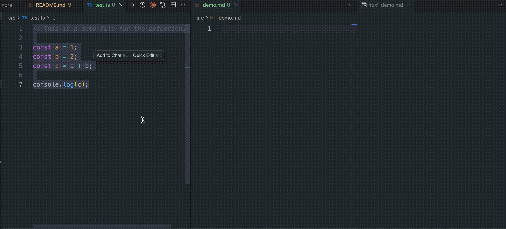

# Pretty Code Copy

A lightweight VS Code extension to copy code “with context” in one keystroke, designed for secnarios like code sharing, issue reporting, vibe coding, etc.

When you copy from the editor using this extension, you can choose which header fields to include via a multi-select picker, then the selected header lines are added above the fenced code block.

## Demo



## Features
Configurable header fields (setting: `PrettyCodeCopy.headers`):

 - source: file path relative to workspace
 - lines: selected (or whole-file) line range
 - language: language identifier used for the fence
 - workspace: current workspace name
 - file: file name only
 - path: absolute file path
 - time: ISO timestamp
 - repoLink: repository permalink to file at current commit (GitHub/GitLab style, with line anchors)
 - gitBranch: current branch name
 - gitShortSha: short commit SHA of HEAD
 - gitLastCommitTime: last commit time (ISO)

## Behavior

- With a selection: copies the selected code and annotates the selected line range.
- No selection: copies the entire file and annotates `1-<last line>`.
- Command: `Copy Code With File Path and Line Numbers` (ID: `PrettyCodeCopy.copy`).
- Default keybinding:
  - macOS: `Cmd+Alt+C`
  - Other platforms: not bound by default; bind `PrettyCodeCopy.copy` yourself in Keyboard Shortcuts.

## Usage

1. Open any code file and ensure the editor has focus (`editorTextFocus`).
2. Optional: select the code to copy; otherwise the whole file is used.
3. Configure once (optional): set `PrettyCodeCopy.headers` in Settings to choose which header fields are included (default: [source, lines]).
4. Trigger one of the following:
   - Press the keybinding (macOS: `Cmd+Alt+C`).
   - Open Command Palette (`Cmd+Shift+P` / `Ctrl+Shift+P`) and run `Copy Code With File Path and Line Numbers`.
5. You will see “Copied code with context!” and the content is in your clipboard.

### Settings examples

- UI: search for “Pretty Code Copy” → “Headers”.
- JSON:

```
"PrettyCodeCopy.headers": ["source", "lines", "language"]
```

### Plain text mode

- Setting: `PrettyCodeCopy.plainText` (boolean, default: false)
- When enabled, the extension outputs plain text without Markdown formatting:
  - Headers are rendered as `Key: Value` (no bold/backticks)
  - Code is appended as-is (no fenced code block)